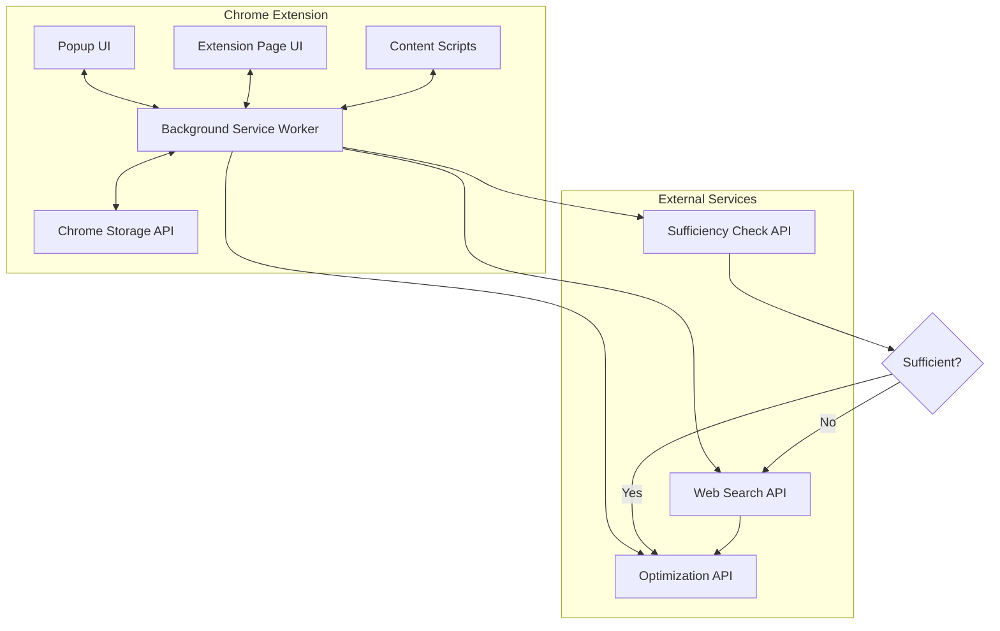

# Design Document: Smart Context Generator Chrome Extension

## Overview

The Smart Context Generator is a Chrome extension that enhances LLM interactions by intelligently gathering, organizing, and optimizing contextual information. The extension uses a dual-interface approach (popup and full page) and maintains session-based context across browser tabs within a window. The system employs a two-stage optimization flow: first determining context sufficiency, then either proceeding directly to optimization or gathering additional information through web research.

### Key Design Principles

1. **Session Persistence**: Context remains consistent across all tabs in a Chrome window
2. **Manual Context Curation**: Users actively gather relevant information through extract functionality
3. **Intelligent Optimization**: AI-driven decision making for context sufficiency and web research
4. **Dual Interface**: Quick popup for common tasks, comprehensive page for detailed management
5. **Non-intrusive**: Extension works alongside existing workflows without disrupting user experience

## Architecture

### High-Level Architecture



### Component Architecture

The extension follows a standard Chrome extension architecture with these key components:

1. **Popup UI** (`popup.html`, `popup.js`, `popup.css`)
   - Lightweight interface for quick actions
   - Session selection and creation
   - Context capture controls
   - Optimize button and status display

2. **Extension Page** (`extension-page.html`, `extension-page.js`, `extension-page.css`)
   - Comprehensive session management
   - Detailed context viewing and editing
   - Session history and analytics
   - Advanced filtering and search

3. **Background Service Worker** (`background.js`)
   - Central message hub
   - API communication handler
   - Session state management
   - Cross-tab coordination

4. **Content Scripts** (`content.js`)
   - Tab content extraction
   - Screenshot capture coordination
   - DOM interaction for context gathering

5. **Storage Layer** (Chrome Storage API)
   - Session data persistence
   - Context item storage
   - User preferences
   - Optimization history

## Components and Interfaces

### 1. Session Management Component

**Responsibilities:**
- Create, read, update, delete sessions
- Associate sessions with Chrome windows
- Track active session per window
- Persist session data

**Data Structure:**
```javascript
interface Session {
  id: string;                    // Unique session identifier
  windowId: number;              // Chrome window ID
  name: string;                  // User-defined session name
  taskDescription: string;       // Original task/issue description
  createdAt: number;             // Timestamp
  updatedAt: number;             // Timestamp
  contextItems: ContextItem[];   // Array of captured context
  optimizationHistory: OptimizationResult[];  // Past optimizations
  status: 'active' | 'archived'; // Session status
}

interface ContextItem {
  id: string;
  type: 'file' | 'screenshot' | 'tab-content';
  content: string | Blob;        // Actual content
  metadata: {
    fileName?: string;
    url?: string;
    timestamp: number;
    size?: number;
  };
}
```

**Key Methods:**
- `createSession(windowId, name, taskDescription): Promise<Session>`
- `getActiveSession(windowId): Promise<Session | null>`
- `updateSession(sessionId, updates): Promise<void>`
- `addContextItem(sessionId, item): Promise<void>`
- `removeContextItem(sessionId, itemId): Promise<void>`
- `archiveSession(sessionId): Promise<void>`

### 2. Context Capture Component

**Responsibilities:**
- Handle file uploads
- Capture screenshots
- Extract tab content
- Process and store captured data

**Implementation Details:**

**File Upload:**
```javascript
// Uses HTML5 File API
async function handleFileUpload(files) {
  for (const file of files) {
    const content = await readFileContent(file);
    const contextItem = {
      id: generateId(),
      type: 'file',
      content: content,
      metadata: {
        fileName: file.name,
        timestamp: Date.now(),
        size: file.size
      }
    };
    await addContextItem(currentSessionId, contextItem);
  }
}
```

**Screenshot Capture:**
```javascript
// Uses Chrome Tabs API
async function captureScreenshot() {
  const [tab] = await chrome.tabs.query({ active: true, currentWindow: true });
  const dataUrl = await chrome.tabs.captureVisibleTab(null, { format: 'png' });
  
  const contextItem = {
    id: generateId(),
    type: 'screenshot',
    content: dataUrl,
    metadata: {
      url: tab.url,
      timestamp: Date.now()
    }
  };
  await addContextItem(currentSessionId, contextItem);
}
```

**Tab Content Extraction:**
```javascript
// Content script injected into active tab
async function extractTabContent() {
  const [tab] = await chrome.tabs.query({ active: true, currentWindow: true });
  
  // Send message to content script
  const response = await chrome.tabs.sendMessage(tab.id, { action: 'extractContent' });
  
  const contextItem = {
    id: generateId(),
    type: 'tab-content',
    content: response.content,
    metadata: {
      url: tab.url,
      title: response.title,
      timestamp: Date.now()
    }
  };
  await addContextItem(currentSessionId, contextItem);
}

// In content script
chrome.runtime.onMessage.addListener((request, sender, sendResponse) => {
  if (request.action === 'extractContent') {
    const content = extractMainContent(); // Smart extraction logic
    sendResponse({
      content: content,
      title: document.title
    });
  }
});
```

### 3. Optimization Flow Component

**Responsibilities:**
- Orchestrate the optimization process
- Handle API communications
- Manage optimization states
- Process and present results

**Flow Implementation:**

```javascript
async function optimizeContext(sessionId) {
  const session = await getSession(sessionId);
  
  // Stage 1: Sufficiency Check
  updateStatus('Checking context sufficiency...');
  const sufficiencyResult = await checkSufficiency({
    taskDescription: session.taskDescription,
    contextItems: session.contextItems
  });
  
  let compiledContext = {
    task: session.taskDescription,
    context: session.contextItems
  };
  
  // Stage 2: Conditional Web Research
  if (!sufficiencyResult.isSufficient) {
    updateStatus('Gathering additional information...');
    const searchQueries = sufficiencyResult.suggestedQueries;
    const researchResults = await performWebResearch(searchQueries);
    
    compiledContext.additionalResearch = researchResults;
  }
  
  // Stage 3: Final Optimization
  updateStatus('Optimizing prompt...');
  const optimizedPrompt = await optimizePrompt(compiledContext);
  
  // Save result
  await saveOptimizationResult(sessionId, {
    optimizedPrompt,
    timestamp: Date.now(),
    usedWebResearch: !sufficiencyResult.isSufficient
  });
  
  updateStatus('Complete!');
  return optimizedPrompt;
}
```

### 4. API Integration Component (Gemini API)

**Responsibilities:**
- Manage Gemini API endpoints
- Handle authentication
- Implement retry logic
- Process API responses with function calling and tool calling

**Gemini API Integration:**

The extension uses Google's Gemini API for all AI operations, leveraging its function calling and tool calling capabilities:

1. **Sufficiency Check**: Uses Gemini with function calling to determine if context is sufficient
2. **Web Search**: Uses Gemini with Google Search tool for gathering additional context
3. **Final Optimization**: Uses Gemini with specific system instructions to generate optimized prompt

**API Configuration:**
```javascript
const GEMINI_CONFIG = {
  apiKey: '', // User-provided API key
  model: 'gemini-1.5-pro', // or gemini-1.5-flash for faster responses
  baseUrl: 'https://generativelanguage.googleapis.com/v1beta',
  temperature: 0.7,
  maxOutputTokens: 2048
};
```

**Function Declarations for Gemini:**

```javascript
// Function for sufficiency check
const sufficiencyCheckFunction = {
  name: 'evaluate_context_sufficiency',
  description: 'Evaluates whether the provided context is sufficient to optimize the prompt for the given task',
  parameters: {
    type: 'object',
    properties: {
      is_sufficient: {
        type: 'boolean',
        description: 'Whether the context is sufficient for the task'
      },
      confidence: {
        type: 'number',
        description: 'Confidence level from 0 to 1'
      },
      reasoning: {
        type: 'string',
        description: 'Explanation of the sufficiency determination'
      },
      suggested_queries: {
        type: 'array',
        items: { type: 'string' },
        description: 'Search queries to gather missing information (only if insufficient)'
      },
      missing_aspects: {
        type: 'array',
        items: { type: 'string' },
        description: 'Specific aspects of information that are missing'
      }
    },
    required: ['is_sufficient', 'confidence', 'reasoning']
  }
};
```

**Gemini API Handler Implementation:**
```javascript
class GeminiAPIHandler {
  constructor(apiKey) {
    this.apiKey = apiKey;
    this.baseUrl = 'https://generativelanguage.googleapis.com/v1beta';
    this.model = 'gemini-1.5-pro';
    this.maxRetries = 3;
  }
  
  async generateContent(prompt, options = {}) {
    const endpoint = `${this.baseUrl}/models/${this.model}:generateContent`;
    
    const requestBody = {
      contents: [{
        parts: [{ text: prompt }]
      }],
      generationConfig: {
        temperature: options.temperature || 0.7,
        maxOutputTokens: options.maxOutputTokens || 2048,
        topP: options.topP || 0.95,
        topK: options.topK || 40
      },
      ...(options.systemInstruction && {
        systemInstruction: {
          parts: [{ text: options.systemInstruction }]
        }
      }),
      ...(options.tools && { tools: options.tools })
    };
    
    return this.makeRequest(endpoint, requestBody);
  }
  
  async generateContentWithFunctions(prompt, functions, systemInstruction) {
    const endpoint = `${this.baseUrl}/models/${this.model}:generateContent`;
    
    const requestBody = {
      contents: [{
        parts: [{ text: prompt }]
      }],
      tools: [{
        functionDeclarations: functions
      }],
      systemInstruction: {
        parts: [{ text: systemInstruction }]
      }
    };
    
    const response = await this.makeRequest(endpoint, requestBody);
    
    // Extract function call from response
    if (response.candidates?.[0]?.content?.parts?.[0]?.functionCall) {
      return response.candidates[0].content.parts[0].functionCall;
    }
    
    return null;
  }
  
  async generateContentWithGoogleSearch(prompt, systemInstruction) {
    const endpoint = `${this.baseUrl}/models/${this.model}:generateContent`;
    
    const requestBody = {
      contents: [{
        parts: [{ text: prompt }]
      }],
      tools: [{
        googleSearch: {} // Enable Google Search grounding
      }],
      systemInstruction: {
        parts: [{ text: systemInstruction }]
      }
    };
    
    const response = await this.makeRequest(endpoint, requestBody);
    
    return {
      text: response.candidates[0].content.parts[0].text,
      groundingMetadata: response.candidates[0].groundingMetadata
    };
  }
  
  async makeRequest(endpoint, data, retries = 0) {
    try {
      const response = await fetch(`${endpoint}?key=${this.apiKey}`, {
        method: 'POST',
        headers: {
          'Content-Type': 'application/json'
        },
        body: JSON.stringify(data)
      });
      
      if (!response.ok) {
        const error = await response.json();
        throw new Error(`Gemini API error: ${error.error?.message || response.status}`);
      }
      
      return await response.json();
    } catch (error) {
      if (retries < this.maxRetries) {
        await this.delay(1000 * Math.pow(2, retries));
        return this.makeRequest(endpoint, data, retries + 1);
      }
      throw error;
    }
  }
  
  delay(ms) {
    return new Promise(resolve => setTimeout(resolve, ms));
  }
}
```

**Optimization Flow with Gemini:**

```javascript
async function optimizeContextWithGemini(sessionId) {
  const session = await getSession(sessionId);
  const gemini = new GeminiAPIHandler(userApiKey);
  
  // Stage 1: Sufficiency Check using Function Calling
  updateStatus('Analyzing context sufficiency...');
  
  const sufficiencyPrompt = `
Task/Issue: ${session.taskDescription}

Available Context:
${formatContextItems(session.contextItems)}

Evaluate if this context is sufficient to create an optimized prompt for the task.
`;
  
  const sufficiencyResult = await gemini.generateContentWithFunctions(
    sufficiencyPrompt,
    [sufficiencyCheckFunction],
    'You are an expert at evaluating context sufficiency for LLM prompts. Analyze the task and available context to determine if additional information is needed.'
  );
  
  const evaluation = sufficiencyResult.args;
  
  let additionalContext = '';
  
  // Stage 2: Web Research using Google Search (if needed)
  if (!evaluation.is_sufficient) {
    updateStatus('Gathering additional information from the web...');
    
    const searchPrompt = `
Task: ${session.taskDescription}
Current Context: ${formatContextItems(session.contextItems)}
Missing Aspects: ${evaluation.missing_aspects.join(', ')}

Search the web and gather relevant information to fill the gaps in the context.
Provide a comprehensive summary of findings.
`;
    
    const searchResult = await gemini.generateContentWithGoogleSearch(
      searchPrompt,
      'You are a research assistant. Search for and synthesize relevant information to help complete the context for the given task.'
    );
    
    additionalContext = searchResult.text;
    
    // Display grounding sources to user
    if (searchResult.groundingMetadata?.webSearchQueries) {
      displaySearchQueries(searchResult.groundingMetadata.webSearchQueries);
    }
  }
  
  // Stage 3: Final Optimization
  updateStatus('Generating optimized prompt...');
  
  const optimizationPrompt = `
Original Task: ${session.taskDescription}

Available Context:
${formatContextItems(session.contextItems)}

${additionalContext ? `Additional Research:\n${additionalContext}\n` : ''}

Create an optimized, comprehensive prompt that incorporates all relevant context in a well-structured format.
`;
  
  const optimizationResult = await gemini.generateContent(
    optimizationPrompt,
    {
      systemInstruction: `You are an expert prompt engineer. Your task is to transform the user's basic task description and gathered context into a highly effective, detailed prompt for an LLM. 

Guidelines:
1. Structure the prompt clearly with sections
2. Include all relevant context from files, screenshots, and research
3. Make implicit requirements explicit
4. Add helpful constraints and expectations
5. Format code snippets and technical details properly
6. Ensure the prompt is self-contained and comprehensive`,
      temperature: 0.7,
      maxOutputTokens: 2048
    }
  );
  
  const optimizedPrompt = optimizationResult.candidates[0].content.parts[0].text;
  
  // Save result
  await saveOptimizationResult(sessionId, {
    optimizedPrompt,
    timestamp: Date.now(),
    usedWebResearch: !evaluation.is_sufficient,
    searchQueries: evaluation.suggested_queries || []
  });
  
  updateStatus('Complete!');
  return optimizedPrompt;
}
```

### 5. UI Components

**Popup UI Structure:**
```
┌─────────────────────────────────┐
│  Smart Context Generator        │
├─────────────────────────────────┤
│  Session: [API Bug Fix ▼]      │
│  [+ New Session]                │
├─────────────────────────────────┤
│  Task/Issue:                    │
│  ┌───────────────────────────┐ │
│  │ Fix API timeout issue...  │ │
│  └───────────────────────────┘ │
├─────────────────────────────────┤
│  Add Context:                   │
│  [📁 Upload Files]              │
│  [📸 Screenshot]                │
│  [📄 Extract Tab Content]       │
├─────────────────────────────────┤
│  Context Items (3):             │
│  • api-docs.md          [×]     │
│  • Screenshot           [×]     │
│  • Stack Overflow       [×]     │
├─────────────────────────────────┤
│  [🚀 Optimize Context]          │
│  [📋 Open Full Page]            │
└─────────────────────────────────┘
```

**Extension Page Structure:**
```
┌──────────────────────────────────────────────────────┐
│  Smart Context Generator                    [Settings]│
├──────────────────────────────────────────────────────┤
│  ┌────────────┐  ┌──────────────────────────────┐   │
│  │ Sessions   │  │  Current Session             │   │
│  │            │  │  Name: API Bug Fix           │   │
│  │ • API Bug  │  │  Created: 2 hours ago        │   │
│  │ • Auth Fix │  │  Items: 5                    │   │
│  │ • UI Update│  │                              │   │
│  │            │  │  Task Description:           │   │
│  │ [+ New]    │  │  ┌────────────────────────┐ │   │
│  └────────────┘  │  │ Fix timeout issue...   │ │   │
│                  │  └────────────────────────┘ │   │
│                  │                              │   │
│                  │  Context Items:              │   │
│                  │  ┌────────────────────────┐ │   │
│                  │  │ 📁 api-docs.md         │ │   │
│                  │  │ 📸 Screenshot 1        │ │   │
│                  │  │ 📄 Stack Overflow      │ │   │
│                  │  │ 📁 error-logs.txt      │ │   │
│                  │  │ 📄 GitHub Issue        │ │   │
│                  │  └────────────────────────┘ │   │
│                  │                              │   │
│                  │  [🚀 Optimize Context]       │   │
│                  └──────────────────────────────┘   │
└──────────────────────────────────────────────────────┘
```

## Data Models

### Storage Schema

Using Chrome Storage API (chrome.storage.local for larger data, chrome.storage.sync for preferences):

```javascript
// Storage structure
{
  // Active sessions by window
  "activeSessions": {
    "windowId_123": "session_abc",
    "windowId_456": "session_def"
  },
  
  // All sessions
  "sessions": {
    "session_abc": {
      id: "session_abc",
      windowId: 123,
      name: "API Bug Fix",
      taskDescription: "Fix timeout issue...",
      createdAt: 1234567890,
      updatedAt: 1234567900,
      contextItems: [...],
      optimizationHistory: [...],
      status: "active"
    }
  },
  
  // User preferences
  "preferences": {
    apiKey: "encrypted_key",
    apiEndpoint: "https://api.example.com",
    autoSaveInterval: 30000,
    maxContextItems: 50
  }
}
```

### Message Passing Protocol

Communication between components uses Chrome's message passing:

```javascript
// Message types
const MessageTypes = {
  // Session management
  CREATE_SESSION: 'create_session',
  GET_ACTIVE_SESSION: 'get_active_session',
  UPDATE_SESSION: 'update_session',
  
  // Context operations
  ADD_CONTEXT_ITEM: 'add_context_item',
  REMOVE_CONTEXT_ITEM: 'remove_context_item',
  CAPTURE_SCREENSHOT: 'capture_screenshot',
  EXTRACT_TAB_CONTENT: 'extract_tab_content',
  
  // Optimization
  START_OPTIMIZATION: 'start_optimization',
  OPTIMIZATION_STATUS: 'optimization_status',
  OPTIMIZATION_COMPLETE: 'optimization_complete',
  OPTIMIZATION_ERROR: 'optimization_error'
};

// Example message
{
  type: MessageTypes.ADD_CONTEXT_ITEM,
  payload: {
    sessionId: 'session_abc',
    contextItem: {...}
  }
}
```

## Error Handling

### Error Categories and Handling Strategies

1. **API Errors**
   - Network failures: Retry with exponential backoff (3 attempts)
   - Authentication errors: Prompt user to re-enter API key
   - Rate limiting: Queue requests and retry after delay
   - Invalid responses: Log error, show user-friendly message

2. **Storage Errors**
   - Quota exceeded: Prompt user to archive old sessions
   - Sync conflicts: Use last-write-wins strategy
   - Corruption: Attempt recovery, fallback to empty state

3. **Content Capture Errors**
   - Permission denied: Request permissions, show instructions
   - Tab closed: Gracefully handle, notify user
   - Content script injection failed: Retry once, then show error

4. **User Input Errors**
   - Invalid file types: Show validation message
   - File too large: Show size limit, suggest alternatives
   - Empty task description: Prevent optimization, show warning

### Error UI Patterns

```javascript
// Error notification system
function showError(error) {
  const notification = {
    type: 'error',
    title: getErrorTitle(error.code),
    message: getErrorMessage(error.code),
    actions: getErrorActions(error.code)
  };
  
  displayNotification(notification);
}

// Example error messages
const ErrorMessages = {
  API_NETWORK_ERROR: {
    title: 'Connection Error',
    message: 'Unable to reach the optimization service. Please check your internet connection.',
    actions: ['Retry', 'Cancel']
  },
  STORAGE_QUOTA_EXCEEDED: {
    title: 'Storage Full',
    message: 'You\'ve reached the storage limit. Archive old sessions to free up space.',
    actions: ['Manage Sessions', 'Dismiss']
  }
};
```

## Testing Strategy

### Unit Testing

**Components to Test:**
- Session management functions
- Context item processing
- API request/response handling
- Storage operations
- Message passing handlers

**Testing Framework:** Jest

**Example Test:**
```javascript
describe('SessionManager', () => {
  test('creates new session with valid data', async () => {
    const session = await createSession(123, 'Test Session', 'Test task');
    expect(session.id).toBeDefined();
    expect(session.windowId).toBe(123);
    expect(session.name).toBe('Test Session');
  });
  
  test('retrieves active session for window', async () => {
    const created = await createSession(123, 'Test', 'Task');
    const retrieved = await getActiveSession(123);
    expect(retrieved.id).toBe(created.id);
  });
});
```

### Integration Testing

**Scenarios to Test:**
1. Complete optimization flow (sufficiency check → optimization)
2. Complete optimization flow with web research
3. Context capture across multiple tabs
4. Session persistence across window close/reopen
5. Popup ↔ Extension Page synchronization

**Testing Approach:** Puppeteer for automated browser testing

### Manual Testing Checklist

- [ ] Create session in popup
- [ ] Upload various file types
- [ ] Capture screenshots from different websites
- [ ] Extract content from various page types
- [ ] Switch tabs and verify session persistence
- [ ] Optimize with sufficient context
- [ ] Optimize with insufficient context (trigger web research)
- [ ] View session in extension page
- [ ] Edit context items
- [ ] Copy optimized prompt
- [ ] Handle API errors gracefully
- [ ] Test with storage quota limits
- [ ] Verify cross-tab synchronization

### Performance Testing

**Metrics to Monitor:**
- Extension load time
- Context capture speed
- API response times
- Storage read/write performance
- Memory usage with large context items

**Performance Targets:**
- Popup opens in < 100ms
- Screenshot capture < 500ms
- Tab content extraction < 1s
- Storage operations < 50ms
- Memory usage < 50MB for typical session

## Security Considerations

1. **API Key Storage**
   - Store Gemini API key encrypted in chrome.storage.local
   - Never expose in client-side code
   - Provide option to use environment variables
   - Validate API key format before storage

2. **Content Security**
   - Sanitize extracted tab content
   - Validate file uploads (type, size)
   - Prevent XSS in displayed content
   - Limit file size to prevent storage issues

3. **Permissions**
   - Request minimal necessary permissions
   - Explain permission usage to users
   - Handle permission denials gracefully

4. **Data Privacy**
   - Keep all data local by default
   - Provide clear data retention policies
   - Allow users to delete all data
   - Inform users that context is sent to Gemini API

5. **API Security**
   - Use HTTPS for all Gemini API calls
   - Implement rate limiting to prevent abuse
   - Handle API errors without exposing sensitive data
   - Validate all API responses

**Manifest Permissions:**
```json
{
  "permissions": [
    "storage",
    "tabs",
    "activeTab",
    "scripting"
  ],
  "host_permissions": [
    "<all_urls>",
    "https://generativelanguage.googleapis.com/*"
  ]
}
```

## Gemini API Documentation References

When implementing, always reference the official Gemini API documentation:

1. **Function Calling**: https://ai.google.dev/gemini-api/docs/function-calling
2. **Google Search Grounding**: https://ai.google.dev/gemini-api/docs/grounding
3. **System Instructions**: https://ai.google.dev/gemini-api/docs/system-instructions
4. **Content Generation**: https://ai.google.dev/gemini-api/docs/text-generation
5. **Best Practices**: https://ai.google.dev/gemini-api/docs/best-practices

**Key Implementation Notes:**
- Use `gemini-1.5-pro` for complex reasoning and function calling
- Use `gemini-1.5-flash` for faster, simpler operations
- Leverage Google Search grounding for web research instead of separate search APIs
- Implement proper error handling for rate limits and quota exceeded errors
- Use system instructions to guide model behavior consistently
- Structure function declarations according to OpenAPI 3.0 schema

## Chrome Built-in AI Integration

### Leveraging Chrome's AI APIs

The extension can utilize Chrome's experimental AI APIs (Prompt API, Summarization API) for enhanced functionality:

```javascript
// Using Chrome's Prompt API for local processing
async function localSufficiencyCheck(context) {
  if ('ai' in window && 'createTextSession' in window.ai) {
    const session = await window.ai.createTextSession({
      systemPrompt: 'Analyze if the provided context is sufficient for the given task.'
    });
    
    const result = await session.prompt(
      `Task: ${context.task}\nContext: ${JSON.stringify(context.items)}`
    );
    
    return parseResult(result);
  }
  
  // Fallback to external API
  return externalSufficiencyCheck(context);
}
```

**Benefits:**
- Faster processing for simple checks
- Works offline
- Reduced API costs
- Privacy-preserving (data stays local)

## Deployment and Distribution

### Build Process

1. Bundle JavaScript files (using Webpack/Rollup)
2. Minify CSS
3. Optimize images
4. Generate manifest.json
5. Create .zip for Chrome Web Store

### Chrome Web Store Submission

**Required Assets:**
- 128x128 icon
- 1280x800 promotional images
- Detailed description
- Privacy policy
- Screenshots of both interfaces

### Version Management

Follow semantic versioning (MAJOR.MINOR.PATCH):
- MAJOR: Breaking changes
- MINOR: New features
- PATCH: Bug fixes

## Future Enhancements

1. **Multi-window Support**: Track sessions across multiple Chrome windows
2. **Collaborative Sessions**: Share sessions with team members
3. **Template System**: Pre-defined context templates for common tasks
4. **Analytics Dashboard**: Insights on optimization patterns
5. **Browser Sync**: Sync sessions across devices
6. **Custom API Endpoints**: Allow users to configure their own AI services
7. **Context Suggestions**: AI-powered suggestions for additional context to gather
8. **Export/Import**: Share sessions as files
